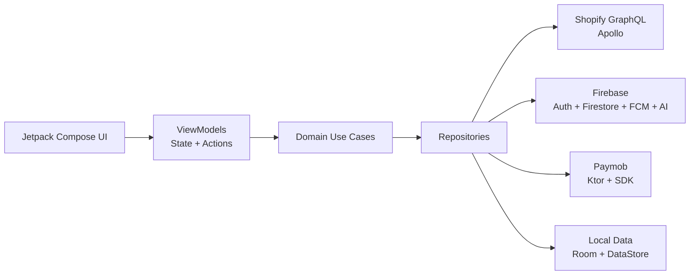

<a id="top"></a>

<p align="center">
  
</p>

<h1 align="center">Pocket Shop</h1>

<p align="center">
  <strong>AI-powered fashion discovery, comparison, and checkout in one pocket-sized experience.</strong>
</p>

<p align="center">
  
</p>

<p align="center">
  
  
  
</p>

<p align="center">
  
  
  
  
</p>


<p align="center">
  <a href="#overview">Overview</a>
  &nbsp;&bull;&nbsp;
  <a href="#showcase">App Showcase</a>
  &nbsp;&bull;&nbsp;
  <a href="#features">Features</a>
  &nbsp;&bull;&nbsp;
  <a href="#architecture">Architecture</a>
  &nbsp;&bull;&nbsp;
  <a href="#technology">Technology</a>
  &nbsp;&bull;&nbsp;
  <a href="#team">Team</a>
</p>

---

<a id="overview"></a>

## 🛍️ Overview

Pocket Shop is a full-featured native Android commerce application that combines a polished storefront with an action-capable AI shopping assistant. Customers can discover products, compare alternatives, build complete outfits, manage a synchronized cart and wishlist, check out securely, and follow their orders without leaving the app.

The storefront is powered by Shopify GraphQL, identity and cloud features are handled by Firebase, AI experiences use Gemini 2.5 Flash through Firebase AI Logic, and online payments are processed through Paymob.

<table>
  <tr>
    <td align="center" width="25%">
      <h3>🤖</h3>
      <strong>AI Shopping Agent</strong><br/>
      <sub>Recommends products, builds outfits, compares options, and performs cart actions.</sub>
    </td>
    <td align="center" width="25%">
      <h3>🛒</h3>
      <strong>Complete Commerce</strong><br/>
      <sub>Discovery, variants, wishlist, cart, coupons, checkout, and order history.</sub>
    </td>
    <td align="center" width="25%">
      <h3>🔔</h3>
      <strong>Smart Promotions</strong><br/>
      <sub>Firebase notifications open rich, personalized offer experiences.</sub>
    </td>
    <td align="center" width="25%">
      <h3>🌍</h3>
      <strong>Personalized Experience</strong><br/>
      <sub>Arabic and English, RTL, currency choices, themes, maps, and saved addresses.</sub>
    </td>
  </tr>
</table>

<br/>

<a id="showcase"></a>

## 📱 App Showcase

Explore the available Pocket Shop screens in both themes. The Dark Mode gallery includes only the screens currently captured in Dark Mode.

<p align="center">
  
</p>

### ☀️ Light Mode

<table>
  <tr>
    <td align="center" valign="top" width="33%">
      <h3>✨</h3>
      <strong>Splash</strong><br/><br/>
      <kbd>
        
      </kbd><br/><br/>
    </td>
    <td align="center" valign="top" width="33%">
      <h3>👋</h3>
      <strong>Onboarding</strong><br/><br/>
      <kbd>
        
      </kbd><br/><br/>
    </td>
    <td align="center" valign="top" width="33%">
      <h3>🏠</h3>
      <strong>Home</strong><br/><br/>
      <kbd>
        
      </kbd><br/><br/>
    </td>
  </tr>

  <tr>
    <td align="center" valign="top" width="33%">
      <h3>👕</h3>
      <strong>Product Details</strong><br/><br/>
      <kbd>
        
      </kbd><br/><br/>
    </td>
    <td align="center" valign="top" width="33%">
      <h3>🤖</h3>
      <strong>AI Shopping Assistant</strong><br/><br/>
      <kbd>
        
      </kbd><br/><br/>
    </td>
    <td align="center" valign="top" width="33%">
      <h3>⚖️</h3>
      <strong>AI Product Comparison</strong><br/><br/>
      <kbd>
        
      </kbd><br/><br/>
    </td>
  </tr>

  <tr>
    <td align="center" valign="top" width="33%">
      <h3>🛒</h3>
      <strong>Cart</strong><br/><br/>
      <kbd>
        
      </kbd><br/><br/>
    </td>
    <td align="center" valign="top" width="33%">
      <h3>💳</h3>
      <strong>Checkout</strong><br/><br/>
      <kbd>
        
      </kbd><br/><br/>
    </td>
    <td align="center" valign="top" width="33%">
      <h3>📦</h3>
      <strong>Order Details</strong><br/><br/>
      <kbd>
        
      </kbd><br/><br/>
    </td>
  </tr>

  <tr>
    <td align="center" valign="top" width="33%">
      <h3>🔎</h3>
      <strong>Search</strong><br/><br/>
      <kbd>
        
      </kbd><br/><br/>
    </td>
    <td align="center" valign="top" width="33%">
      <h3>🎛️</h3>
      <strong>Filters</strong><br/><br/>
      <kbd>
        
      </kbd><br/><br/>
    </td>
    <td align="center" valign="top" width="33%">
      <h3>👤</h3>
      <strong>Profile</strong><br/><br/>
      <kbd>
        
      </kbd><br/><br/>
    </td>
  </tr>

  <tr>
    <td align="center" valign="top" width="33%">
      <h3>🔐</h3>
      <strong>Sign In</strong><br/><br/>
      <kbd>
        
      </kbd><br/><br/>
    </td>
    <td align="center" valign="top" width="33%">
      <h3>📝</h3>
      <strong>Sign Up</strong><br/><br/>
      <kbd>
        
      </kbd><br/><br/>
    </td>
    <td align="center" valign="top" width="33%">
      <h3>⚙️</h3>
      <strong>Settings</strong><br/><br/>
      <kbd>
        
      </kbd><br/><br/>
    </td>
  </tr>
</table>


### 🌙 Dark Mode

<table>
  <tr>
    <td align="center" valign="top" width="33%">
      <h3>✨</h3>
      <strong>Splash</strong><br/><br/>
      <kbd>
</kbd><br/><br/>
    </td>
    <td align="center" valign="top" width="33%">
      <h3>👋</h3>
      <strong>Onboarding</strong><br/><br/>
      <kbd>
</kbd><br/><br/>
    </td>
    <td align="center" valign="top" width="33%">
      <h3>🏠</h3>
      <strong>Home</strong><br/><br/>
      <kbd>
</kbd><br/><br/>
    </td>
  </tr>

  <tr>
    <td align="center" valign="top" width="33%">
      <h3>👕</h3>
      <strong>Product Details</strong><br/><br/>
      <kbd>
</kbd><br/><br/>
    </td>
    <td align="center" valign="top" width="33%">
      <h3>🔎</h3>
      <strong>Search</strong><br/><br/>
      <kbd>
</kbd><br/><br/>
    </td>
    <td align="center" valign="top" width="33%">
      <h3>👤</h3>
      <strong>Profile</strong><br/><br/>
      <kbd>
</kbd><br/><br/>
    </td>
  </tr>

  <tr>
    <td align="center" valign="top" width="33%">
      <h3>🛒</h3>
      <strong>Cart</strong><br/><br/>
      <kbd></kbd><br/><br/>
    </td>
    <td align="center" valign="top" width="33%">
      <h3>💳</h3>
      <strong>Checkout</strong><br/><br/>
      <kbd>
</kbd><br/><br/>
    </td>
    <td align="center" valign="top" width="33%">
      <h3>📦</h3>
      <strong>Order Details</strong><br/><br/>
      <kbd>
</kbd><br/><br/>
    </td>
  </tr>
  <tr>
    <td align="center" valign="top" width="33%">
      <h3>🔐</h3>
      <strong>Sign In</strong><br/><br/>
      <kbd>
</kbd><br/><br/>
    </td>
    <td align="center" valign="top" width="33%">
      <h3>📝</h3>
      <strong>Sign Up</strong><br/><br/>
      <kbd>
</kbd><br/><br/>
    </td>
    <td align="center" valign="top" width="33%">
      <h3>⚙️</h3>
      <strong>Settings</strong><br/><br/>
      <kbd>
</kbd><br/><br/>
    </td>
  </tr>
</table>

---

<a id="features"></a>

## ✨ What Makes Pocket Shop Different

### 🤖 AI Shopping Assistant

- Chat naturally about products, styles, occasions, colors, sizes, and shopping needs.
- Search the live Shopify catalog and return tappable product recommendations.
- Attach an image to discover visually similar products from the store.
- Generate complete outfits or build an outfit around a selected product.
- Compare a product with similar alternatives using AI-generated pros, cons, recommendations, and comparison tables.
- Execute in-app tools to inspect product variants, read the current cart, and add selected items to the cart.
- Keep the conversation available while navigating between chat and product screens.
- Use quick-reply choices when the assistant needs a focused preference from the shopper.

### 🛒 Complete Commerce Journey

- Browse featured products, best sellers, new arrivals, categories, and brands.
- Use predictive search, full catalog search, dynamic Shopify filters, price ranges, and relevance or price sorting.
- Explore image galleries, descriptions, options, variants, pricing, availability, ratings, and reviews.
- Create, update, and delete product reviews with confirmation for destructive actions.
- Save favorites locally and synchronize the wishlist through Firestore.
- Add, remove, and update cart items with local persistence and Shopify synchronization.
- Apply or remove Shopify discount codes and see totals update during checkout.
- Pay online with Paymob or choose cash on delivery.
- View order confirmation, order history, and detailed line items.

### 👤 Accounts and Personalization

- Continue as a guest, register with email and password, or sign in with Google.
- Verify email addresses, resend verification messages, and reset forgotten passwords.
- Restrict cart and wishlist actions when guest access is not sufficient.
- Manage multiple Shopify customer addresses and select a default delivery address.
- Pick an address from a map, use the current location, reverse-geocode coordinates, search for locations, or import contact details.
- Switch between English and Arabic with RTL support.
- Choose light, dark, or system theme and display prices in EGP or USD.

### 🔔 Smart Promotions and Reliability

- Receive Firebase Cloud Messaging promotions through the shared `all` topic.
- Open a notification directly into a three-step, onboarding-style offer experience.
- Load offer content from Firestore, display a remote image, reveal the coupon, and copy its code.
- Cache cart and wishlist data with Room for responsive local rendering.
- Persist app settings with DataStore and store customer credentials securely.
- Surface connection state with an offline banner and map failures into user-friendly errors.


---

<a id="architecture"></a>

## 🧱 Architecture

Pocket Shop follows a feature-oriented Clean Architecture approach with an MVI-style presentation layer. Screens expose immutable state and actions through ViewModels, domain use cases isolate business rules, and repositories coordinate remote and local data sources.



<details>
<summary><strong>📁 Explore the module structure</strong></summary>

<br/>

```text
pocket-shop/
|-- app/                    # Application shell and product features
|   `-- src/main/
|       |-- graphql/
|       |   |-- client/     # Shopify Storefront operations and schema
|       |   `-- admin/      # Shopify Admin operations and schema
|       `-- java/.../
|           |-- common/     # Session, favorites, and settings
|           |-- core/       # DI, database, notifications, connectivity
|           `-- features/   # Auth, catalog, AI, cart, checkout, and more
|-- core/
|   |-- designsystem/       # Theme, typography, colors, and shared styling
|   `-- network/            # Shared result and network error handling
`-- features/
    `-- payment/            # Reusable Paymob payment module
```

</details>


---

<a id="technology"></a>

## 🧰 Built With

| Area | Technologies |
| --- | --- |
| 🎨 Language and UI | Kotlin, Jetpack Compose, Material 3, Navigation 3 |
| 🧩 Architecture | Clean Architecture, MVI-style state management, Coroutines, Flow |
| 💉 Dependency injection | Hilt, KSP |
| 🛍️ Commerce | Shopify Storefront and Admin GraphQL APIs, Apollo Kotlin |
| ✨ AI | Firebase AI Logic, Gemini 2.5 Flash, function calling, multimodal prompts |
| 🔥 Firebase | Authentication, Firestore, Cloud Messaging, Analytics |
| 🌐 Networking | Ktor Client, OkHttp, Kotlinx Serialization |
| 💾 Local data | Room, DataStore |
| 💳 Payments | Paymob Android SDK and Intention API |
| 📍 Location | Google Maps Compose, Play Services Location, Android Geocoder |
| 🎞️ Media and motion | Coil, Lottie |

<p align="center">
  
  
  
  
  
</p>


---

<a id="team"></a>

<h2 align="center">👥 Meet the Team</h2>

<p align="center">
  The developers behind Pocket Shop
</p>

<br/>

<table align="center" width="100%">
  <tr>
    <td align="center" valign="top" width="25%">
      <br/>
      <a href="https://github.com/ELDemy">
        
      </a>
      <br/><br/>
      <strong>Mahmoud ELDemerdash</strong>
      <br/>
      <sub>Team Member</sub>
      <br/><br/>
      <a href="https://github.com/ELDemy">
        
      </a>
      <br/><br/>
    </td>
    <td align="center" valign="top" width="25%">
      <br/>
      <a href="https://github.com/Amrabedalrehem">
        
      </a>
      <br/><br/>
      <strong>Amr Abdulrehim Elhammamy</strong>
      <br/>
      <sub>Team Member</sub>
      <br/><br/>
      <a href="https://github.com/Amrabedalrehem">
        
      </a>
      <br/><br/>
    </td>  
    <td align="center" valign="top" width="25%">
      <br/>
      <a href="https://github.com/Hossam-Elgmmal">
        
      </a>
      <br/><br/>
      <strong>Hossam Elgmmal</strong>
      <br/>
      <sub>Team Member</sub>
      <br/><br/>
      <a href="https://github.com/Hossam-Elgmmal">
        
      </a>
      <br/><br/>
    </td>
    <td align="center" valign="top" width="25%">
      <br/>
      <a href="https://github.com/Abdelhamed-Zyada">
        
      </a>
      <br/><br/>
      <strong>Abdelhamed Zyada</strong>
      <br/>
      <sub>Team Member</sub>
      <br/><br/>
      <a href="https://github.com/Abdelhamed-Zyada">
        
      </a>
      <br/><br/>
    </td>
  </tr>
</table>

<br/>

<p align="center">
  🎓 Mentored by <strong>Omar Metwally</strong>
</p>

<br/>

<p align="center">
  <strong>Built with ❤️ by the Pocket Shop team.</strong>
</p>

<p align="center">
  <a href="#top">⬆ Back to top</a>
</p>
